# Assessment Management System

A comprehensive Python-based system for analyzing coding assessments, evaluating solutions, and generating detailed reports.

## Overview

The Assessment Management System is designed to help educators, hiring managers, and technical interviewers evaluate coding solutions with precision and consistency. The system analyzes solutions based on multiple dimensions:

- **Correctness**: Evaluates if the solution passes test cases
- **Code Quality**: Analyzes complexity, maintainability, and structure
- **AI Detection**: Identifies patterns common in AI-generated code
- **Style Analysis**: Checks adherence to coding conventions
- **Performance Analysis**: Estimates time and space complexity
- **Naming Conventions**: Evaluates variable and function naming

## Key Features

- **MongoDB Integration**: Stores assessments, solutions, and analysis results
- **Multi-dimensional Analysis**: Evaluates code across 6+ dimensions
- **Automated Reporting**: Generates individual and comparative reports
- **RESTful API**: Provides programmatic access to all functionality
- **Swagger Documentation**: Interactive API documentation
- **Professional Dataset**: Includes 5 assessment types with 50 solutions each
- **No Authentication Required**: All endpoints are publicly accessible

## System Architecture

```
assessment-system/
├── server/                # Core server components
│   ├── api.py             # API endpoints
│   ├── server.py          # Server initialization
│   ├── services/          # Core services
│   │   ├── analyzers/     # Analysis components
│   │   ├── transformers/  # Data transformation
│   │   ├── database_service.py
│   │   ├── analysis_service.py
│   │   ├── ranking_service.py
│   │   ├── reporting_service.py
│   │   └── code_execution_service.py  # Docker-based code execution
│   └── utils/             # Utility functions
├── scripts/               # Utility scripts
│   ├── drop_database.sh
│   ├── add_dummy_data.sh
│   ├── load_professional_data.sh
│   ├── start_api_server.sh
│   ├── analyze_all.sh
│   ├── generate_reports.sh
│   └── start_docker.sh    # Start Docker containers
├── docker/                # Docker configuration
│   └── code-execution/    # Code execution environment
├── sample_data/           # Sample data for testing
├── tests/                 # Unit and integration tests
├── postman/               # Postman collection
└── README.md              # Documentation
```

## Installation

### Prerequisites

- Python 3.8+
- MongoDB 4.4+
- Docker (optional)

### Setup

1. Clone the repository:

```bash
git clone https://github.com/amrmustafa282/assessment-management-system.git
cd assessment-management-system
```

2. Create and activate a virtual environment:

```bash
python -m venv venv
source venv/bin/activate  # On Windows: venv\Scripts\activate
```

3. Install dependencies:

```bash
pip install -r requirements.txt
```

4. Start Docker services (MongoDB and code execution environment):

```bash
# Start all Docker services
./scripts/start_docker.sh

# Or manually using docker-compose
docker-compose up -d
```

> **Important**: Docker is required for code execution. The system enforces Docker-only execution for security reasons and does not fall back to local execution.

5. Make scripts executable:

```bash
chmod +x scripts/*.sh
```

## Usage

### Loading Data

The system comes with scripts to load sample data:

```bash
# Add basic dummy data
./scripts/add_dummy_data.sh

# Load professional dataset (5 tests with 50 solutions each)
./scripts/load_professional_data.sh

# Clear database and load professional data
./scripts/load_professional_data.sh --drop-existing
```

### Starting the API Server

```bash
./scripts/start_api_server.sh
```

The API server will be available at http://localhost:5002.

### Analyzing Solutions

```bash
# Analyze all unprocessed solutions
./scripts/analyze_all.sh

# Or using Python directly
python -m server.server --analyze-all
```

### Generating Reports

```bash
# Generate reports for all tests
./scripts/generate_reports.sh

# Or using Python directly
python -m server.server --generate-reports
```

## API Documentation

The API is documented using Swagger (OpenAPI). You can access the interactive documentation at:

```
http://localhost:5002/api/docs/
```

### Key Endpoints

#### Assessments

| Method | Endpoint                  | Description               |
| ------ | ------------------------- | ------------------------- |
| GET    | /api/assessments          | Get all assessments       |
| GET    | /api/assessments/:test_id | Get a specific assessment |
| POST   | /api/assessments          | Create a new assessment   |
| PUT    | /api/assessments/:test_id | Update an assessment      |
| DELETE | /api/assessments/:test_id | Delete an assessment      |

#### Solutions

| Method | Endpoint                            | Description                           |
| ------ | ----------------------------------- | ------------------------------------- |
| GET    | /api/solutions                      | Get all solutions                     |
| GET    | /api/solutions/:solution_id         | Get a specific solution               |
| GET    | /api/assessments/:test_id/solutions | Get all solutions for a specific test |
| POST   | /api/solutions                      | Create a new solution                 |

#### Analysis

| Method | Endpoint                           | Description                               |
| ------ | ---------------------------------- | ----------------------------------------- |
| GET    | /api/analysis/:solution_id         | Get analysis for a specific solution      |
| POST   | /api/analyze/solution/:solution_id | Analyze a specific solution               |
| POST   | /api/analyze/test/:test_id         | Analyze all solutions for a specific test |
| POST   | /api/analyze/all                   | Analyze all unprocessed solutions         |

#### Reports

| Method | Endpoint                       | Description                         |
| ------ | ------------------------------ | ----------------------------------- |
| GET    | /api/reports                   | Get all reports                     |
| GET    | /api/reports/:report_id        | Get a specific report               |
| GET    | /api/reports/test/:test_id     | Get report for a specific test      |
| POST   | /api/reports/generate/:test_id | Generate report for a specific test |
| POST   | /api/reports/generate/all      | Generate reports for all tests      |

## Professional Dataset

The system includes a professional dataset with:

- 5 different assessment types:
  - Python Basics
  - JavaScript Basics
  - Java Basics
  - Data Structures
  - Algorithms
- 50 solutions per assessment with varying quality
- Realistic answers for MCQ, open-ended, and coding questions
- Automatic analysis of all solutions
- Generated reports for each assessment

## Analysis Features

### Correctness Analysis

- Executes code against test cases in a secure Docker environment
- Enforces Docker-only execution for security
- Supports multiple programming languages:
  - Python
  - JavaScript
  - Java
  - Go
  - Ruby
  - C++
- Automatically detects function names and parameters
- Intelligently handles array inputs based on function signatures
- Calculates correctness score based on test case results
- Takes into account the number of passed tests
- Provides detailed error messages and execution metrics
- Handles permission errors gracefully when cleaning up temporary files

### Code Quality Analysis

- Measures cyclomatic complexity
- Calculates maintainability index
- Analyzes comment ratio and function count

### AI Detection

- Detects patterns common in AI-generated code
- Calculates probability of AI generation
- Identifies specific patterns that suggest AI generation

### Style Analysis

- Checks adherence to coding style conventions
- Analyzes naming conventions
- Identifies style issues

### Performance Analysis

- Estimates time and space complexity
- Compares with expected complexity
- Suggests optimizations

## Report Generation

The system generates two types of reports:

1. **Individual Reports**: Detailed analysis of a single candidate's performance
2. **Comparative Reports**: Comparison of all candidates for a specific test

Reports include:

- Overall scores and rankings
- Detailed breakdown by analysis dimension
- Comparative tables for easy comparison
- Visualizations of performance metrics

## Schema

```mermaid
erDiagram
    TESTS {
        ObjectId _id PK
        string testId UK
        string createdAt
        string updatedAt
        string description
        string name
        string title
        string jobId
        integer duration
        integer timeLimit
        string startDate
        string endDate
        string startTime
        string endTime
        array questions
        array codingQuestions
    }

    QUESTIONS {
        string id PK
        string type
        string text
        integer order
        string difficulty
        boolean required
        boolean deleted
        object correctAnswer
        object options
    }

    QUESTION_CHOICES {
        string id PK
        string text
        boolean isCorrect
        integer order
    }

    CODING_QUESTIONS {
        string title
        string text
        string language
        integer order
        string starterCode
        string solutionCode
        object metadata
        object evaluationCriteria
        object gradingRules
        array testCases
    }

    CODING_METADATA {
        string difficulty
        integer estimatedDuration
        array tags
    }

    EVALUATION_CRITERIA {
        string timeComplexity
        string spaceComplexity
        array constraints
    }

    GRADING_RULES {
        double testCaseWeight
        double codeQualityWeight
        double efficiencyWeight
        boolean partialCredit
    }

    TEST_CASES {
        string input
        string expected_output
        double weight
    }

    SOLUTIONS {
        ObjectId _id PK
        string solution_id UK
        string candidate_id
        string test_id FK
        string started_at
        string completed_at
        string last_activity
        integer time_taken
        integer time_remaining
        integer current_question
        integer answered_questions
        integer total_questions
        array answers
        array coding_answers
        array draft_answers
    }

    ANSWERS {
        string question_id FK
        string answer_type
        string value
        string submitted_at
    }

    CODING_ANSWERS {
        string question_id FK
        string code
        string language
        double execution_time
        integer memory_usage
        string submitted_at
    }

    DRAFT_ANSWERS {
        string question_id FK
        string answer_type
        string value
    }

    ANALYSES {
        ObjectId _id PK
        string analysis_id UK
        string candidate_id
        string test_id FK
        string solution_id FK
        string analyzed_at
        double overall_score
        array coding_analyses
        array mcq_analyses
        array open_ended_analyses
    }

    CODING_ANALYSES {
        string question_id FK
        double overall_score
        double correctness_score
        object ai_detection
        object code_quality
        object performance_analysis
        object style_analysis
        array test_case_results
    }

    AI_DETECTION {
        double ai_generated_probability
        string detection_method
        array flagged_patterns
    }

    CODE_QUALITY {
        integer line_count
        integer function_count
        double comment_ratio
        double cyclomatic_complexity
        object maintainability_index
        null halstead_volume
    }

    MAINTAINABILITY_INDEX {
        double mi
        string rank
    }

    PERFORMANCE_ANALYSIS {
        string time_complexity
        double time_complexity_score
        string space_complexity
        double space_complexity_score
        double efficiency_score
        array optimization_suggestions
    }

    STYLE_ANALYSIS {
        double style_score
        double naming_convention_score
        array style_issues
    }

    STYLE_ISSUES {
        string issue_type
        integer line_number
        string message
        string severity
    }

    TEST_CASE_RESULTS {
        string test_case_id FK
        boolean passed
        string expected_output
        string actual_output
        double execution_time
        double memory_usage
        null error_message
    }

    MCQ_ANALYSES {
        string question_id FK
        boolean is_correct
        double correctness_score
    }

    OPEN_ENDED_ANALYSES {
        string question_id FK
        double overall_score
        double clarity_score
        double relevance_score
    }

    REPORTS {
        ObjectId _id PK
        string report_id UK
        string test_id FK
        string generated_at
        integer candidate_count
        double average_score
        object score_distribution
        object coding_performance
        object mcq_performance
        object open_ended_performance
        array top_candidates
    }

    SCORE_DISTRIBUTION {
        integer excellent
        integer good
        integer average
        integer poor
    }

    CODING_PERFORMANCE {
        double average_score
        double average_test_pass_rate
        object metrics
    }

    CODING_METRICS {
        double correctness
        double code_quality
        double performance
        double style
        double originality
    }

    MCQ_PERFORMANCE {
        double average_score
    }

    OPEN_ENDED_PERFORMANCE {
        double average_score
        object metrics
    }

    OPEN_ENDED_METRICS {
        double clarity
        double relevance
    }

    TOP_CANDIDATES {
        string candidate_id FK
        string solution_id FK
        string analysis_id FK
        integer rank
        string ranked_at
        double overall_score
        double coding_score
        double mcq_score
        double open_ended_score
        object coding_details
        object mcq_details
        object open_ended_details
    }

    CANDIDATE_CODING_DETAILS {
        double overall
        double correctness
        double code_quality
        double performance
        double style
        double originality
        integer passed_tests
        integer total_tests
        double test_pass_rate
    }

    CANDIDATE_MCQ_DETAILS {
        double overall
        double correctness
        integer correct_count
        integer total_count
        double correct_rate
    }

    CANDIDATE_OPEN_ENDED_DETAILS {
        double overall
        double clarity
        double relevance
    }

    JOBS {
        ObjectId _id PK
        string job_id UK
        string job_type
        string status
        integer progress
        string created_at
        string updated_at
        string completed_at
        object job_data
        object result
        null error
    }

    JOB_DATA {
        string test_id FK
        string solution_id FK
    }

    JOB_RESULT {
        string analysis_id FK
        array analysis_ids
    }

    JOB_LOGS {
        ObjectId _id PK
        string job_id FK
        string message
        string timestamp
    }

    %% Core Test Structure Relationships
    TESTS ||--o{ QUESTIONS : contains
    TESTS ||--o{ CODING_QUESTIONS : includes
    QUESTIONS ||--o{ QUESTION_CHOICES : has
    CODING_QUESTIONS ||--|| CODING_METADATA : has
    CODING_QUESTIONS ||--|| EVALUATION_CRITERIA : defines
    CODING_QUESTIONS ||--|| GRADING_RULES : uses
    CODING_QUESTIONS ||--o{ TEST_CASES : includes

    %% Solution and Answer Relationships
    TESTS ||--o{ SOLUTIONS : generates
    SOLUTIONS ||--o{ ANSWERS : contains
    SOLUTIONS ||--o{ CODING_ANSWERS : includes
    SOLUTIONS ||--o{ DRAFT_ANSWERS : stores

    %% Analysis Relationships
    SOLUTIONS ||--|| ANALYSES : analyzed_by
    TESTS ||--o{ ANALYSES : evaluated_for
    ANALYSES ||--o{ CODING_ANALYSES : contains
    ANALYSES ||--o{ MCQ_ANALYSES : includes
    ANALYSES ||--o{ OPEN_ENDED_ANALYSES : evaluates

    %% Detailed Analysis Structure
    CODING_ANALYSES ||--|| AI_DETECTION : uses
    CODING_ANALYSES ||--|| CODE_QUALITY : measures
    CODING_ANALYSES ||--|| PERFORMANCE_ANALYSIS : analyzes
    CODING_ANALYSES ||--|| STYLE_ANALYSIS : reviews
    CODING_ANALYSES ||--o{ TEST_CASE_RESULTS : produces
    CODE_QUALITY ||--|| MAINTAINABILITY_INDEX : calculates
    STYLE_ANALYSIS ||--o{ STYLE_ISSUES : identifies

    %% Question-Answer Relationships
    QUESTIONS ||--o{ ANSWERS : answered_by
    CODING_QUESTIONS ||--o{ CODING_ANSWERS : solved_by
    QUESTIONS ||--o{ MCQ_ANALYSES : evaluated_in
    QUESTIONS ||--o{ OPEN_ENDED_ANALYSES : assessed_in
    CODING_QUESTIONS ||--o{ CODING_ANALYSES : analyzed_in

    %% Report Relationships
    TESTS ||--o{ REPORTS : summarized_in
    REPORTS ||--|| SCORE_DISTRIBUTION : shows
    REPORTS ||--|| CODING_PERFORMANCE : analyzes
    REPORTS ||--|| MCQ_PERFORMANCE : evaluates
    REPORTS ||--|| OPEN_ENDED_PERFORMANCE : assesses
    REPORTS ||--o{ TOP_CANDIDATES : ranks

    %% Report Detail Structures
    CODING_PERFORMANCE ||--|| CODING_METRICS : contains
    OPEN_ENDED_PERFORMANCE ||--|| OPEN_ENDED_METRICS : includes
    TOP_CANDIDATES ||--|| CANDIDATE_CODING_DETAILS : details
    TOP_CANDIDATES ||--|| CANDIDATE_MCQ_DETAILS : shows
    TOP_CANDIDATES ||--|| CANDIDATE_OPEN_ENDED_DETAILS : includes

    %% Job Processing Relationships
    JOBS ||--|| JOB_DATA : contains
    JOBS ||--|| JOB_RESULT : produces
    JOBS ||--o{ JOB_LOGS : generates

    %% Cross-References
    SOLUTIONS ||--o{ TOP_CANDIDATES : featured_in
    ANALYSES ||--o{ TOP_CANDIDATES : ranked_by
```


## Contributing

Contributions are welcome! Please feel free to submit a Pull Request.

## License

This project is licensed under the MIT License - see the LICENSE file for details.

## Acknowledgments

- MongoDB for database functionality
- Flask for API framework
- Swagger for API documentation
